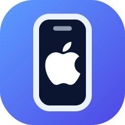
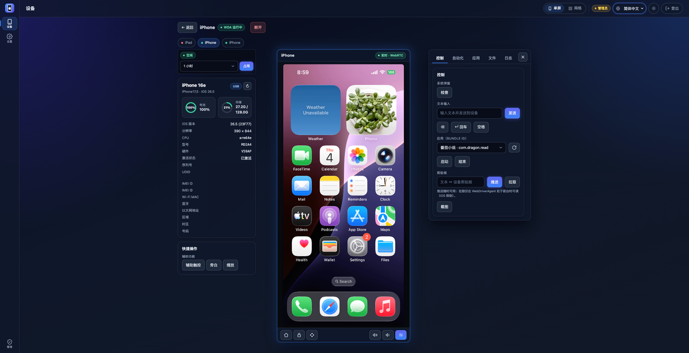
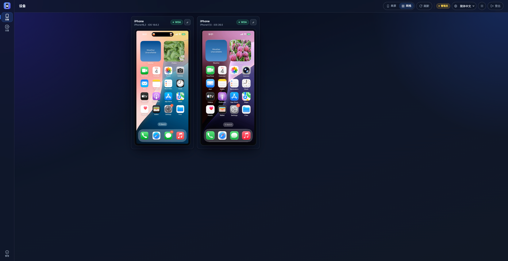

# WebAppFlaskauto-iOS — Web端iOS投屏/控制/运维平台

<div align="center">



**基于WebDriverAgent的Web端iOS投屏/控制/运维平台**

[](https://python.org)
[](https://flask.palletsprojects.com)
[](https://vuejs.org)
[](https://github.com/aiortc/aiortc)
[](https://github.com/doronz88/pymobiledevice3)
[](LICENSE)

[中文](README.md) • [English](README_en.md)

[功能特性](#功能特性) • [快速开始](#快速开始) • [安全设计](#安全设计) • [API 文档](#api-文档) • [故障排除](#故障排除)

</div>

> 本仓库是 Android 项目 **WebAppFlaskscrcpy** 的 **iOS 对照实现**：刻意对齐其架构与技术栈（Flask + Flask-SocketIO 后端、`api/` + `services/` + 平台适配层、Vue 3 前端的 `components/` + `composables/`），便于日后合并为统一平台。**本仓库只实现 iOS。**

## 项目简介

WebAppFlaskauto-iOS 是一个**纯浏览器**的 iOS 真机远程镜像与控制平台。无需安装任何客户端，打开网页即可:发现已连接的 iPhone、实时镜像屏幕、远程触控/滑动/输入、截图、管理应用、浏览/预览/传输文件、查看实时系统日志、运行 UI 自动化定位。

底层通过 **WebDriverAgent(WDA)** 驱动设备,画面采用 **WDA MJPEG(主)+ 截图轮询(兜底)**,并可选开启 **WebRTC(aiortc)** 低延迟视频。设备发现与 lockdown 信息走纯 Python 的 **pymobiledevice3**;iOS 17+ 的免管理员隧道与拉起 WDA 由内置 **go-ios** 负责。

在镜像能力之上,平台内置完整的**账号体系**与**设备占用(预约)机制**,可作为团队共享的 iOS 真机运维台:谁在用哪台设备一目了然,管理员可强制释放、管理用户。

## 界面展示

<div align="center">

**单设备界面**



**多设备状态**



</div>

## 项目立项背景

### 行业背景

iOS 真机的远程测试、运维、演示是高频需求,但相比 Android 门槛更高、痛点更突出:

- **接入复杂**:Appium/Xcode/tidevice 链路重,iOS 17+ 还要起隧道(常需管理员)。
- **多人争抢**:一台真机被多人同时连接互相打断,缺乏排他与调度。
- **缺权限边界**:谁都能连、谁都能控,没有账号与角色,运维不可审计。
- **跨平台割裂**:Windows / macOS / Linux 上的隧道、usbmux、进程管理各不相同。

### 项目目标

1. **零客户端**:浏览器即操作台,局域网内任意设备可访问。
2. **免管理员**:iOS 17+ 用 go-ios 的**用户态 RSD 隧道**自动拉起 WDA,无需 elevated tunneld。
3. **可管控**:账号 + 角色 + 设备占用,让真机成为可调度、可审计的共享资源。
4. **跨平台 + 轻量**:直连 WDA(不装 Appium Server),一套代码三大系统可跑。

## 解决的实际痛点

### 1. iOS 远程操控接入门槛高
**痛点**:Appium Server / Xcode / 各类工具链路重、版本敏感。
**方案**:**直接用 HTTP 与 WebDriverAgent 通信**,不安装 Appium Server 进程;设备发现/usbmux 端口转发/WDA HTTP 全部交给纯 Python 的 **pymobiledevice3**,Flask 原生友好。

### 2. iOS 17+ 隧道需要管理员
**痛点**:iOS 17+ 的 RSD 隧道在 Windows 上通常要管理员权限。
**方案**:内置 **go-ios** 二进制只负责 pymobiledevice3 免管理员做不了的那一件事——**用户态 RSD 隧道 + `ios runwda` 拉起 WDA**(默认 `IOS_USE_GOIOS=1`)。go-ios 可选,缺失时回退到 pymobiledevice3 的 xcuitest 启动器。

### 3. 多人争抢同一台设备
**痛点**:真机稀缺,多人同时连接互相干扰,无法排他。
**方案**:**设备占用(预约)机制**——按需占用一段时间,期间仅占用者可控制;支持本人释放、到期自动回收、管理员强制释放。

### 4. 没有权限与审计
**痛点**:无账号体系,谁都能连、不可控、不可查。
**方案**:内置三级角色账号体系(超级管理员 / 管理员 / 普通用户)、服务端会话、统一登录闸门、管理员用户管理面板。

### 5. 跨平台运行差异
**痛点**:隧道、usbmux、端口/进程管理在三大系统上都不一样。
**方案**:`start_dev.py` 一键启动器按操作系统分支(端口清理、进程组、venv 路径);go-ios 二进制按平台内置,macOS/Linux 首用时自动从 `resources/utils/` 解压。

## 项目实现原理

### 核心架构

```
浏览器 (Vue3 SPA)
   │  HTTP /api/*         Socket.IO(设备/画面/控制/日志)   WebRTC(可选, 视频+控制 DataChannel)
   ▼                            ▼                              ▼
Flask + Flask-SocketIO (async_mode="threading")
   │  api/  →  services/  →  ios/ios_adapter.py
   ▼
IOSAdapter
 ├─ DeviceManager     pymobiledevice3:设备发现 / lockdown 信息              ┐ Flask 原生主路径
 ├─ PortForward       pymobiledevice3 usbmux:本地端口 → WDA 8100/9100      │ (无需隧道)
 ├─ WDAController     WebDriverAgent HTTP:tap/swipe/text/截图/应用/弹窗     ┘
 ├─ GoIOS + Tunnel    go-ios:用户态 RSD 隧道(免管理员) + `runwda`         ← iOS 17+ 拉起
 ├─ ScreenProvider    wda_mjpeg(主) / wda_screenshot(兜底)
 └─ StreamBridge      画面帧 → Socket.IO room=udid
                      WebRTCBridge → aiortc(JpegVideoTrack, 宿主侧 libx264)
   ▼
SQLite (账号 / 会话 / 设备占用)
```

### 引擎分工(刻意设计)

- **pymobiledevice3(纯 Python,主引擎)**:做一切不需要隧道的事——设备发现、usbmux 端口转发到 WDA(8100 控制 / 9100 MJPEG)、所有 WDA HTTP。
- **go-ios(可选,补位)**:只负责 pymobiledevice3 在 Windows/iOS 17+ 免管理员做不到的——**用户态隧道 + 拉起 WDA**。它是*互补*而非替换:缺失即回退 pymobiledevice3。(go-ios ≠ tidevice;本项目不使用 tidevice。)

### 画面链路(为什么 MJPEG 优先)

iOS 没有 scrcpy 式的 H.264 镜像(除非走 macOS 采集路径)。最快可用的回路是 **WDA 的 MJPEG**(主)+ **截图轮询**(兜底),两者都跨平台。可选开启 **WebRTC**(`IOS_ENABLE_WEBRTC=1`):`JpegVideoTrack` 把 MJPEG 字节解码后用 aiortc(H264 优先,VP8 兜底)重编码,并支持流中自愈(无缝切到截图源);浏览器侧 `control` DataChannel 复用同一条 PeerConnection 传输触控。`IOS_WEBRTC_MAX_BITRATE`(默认 6 Mbps)抬高码率上限改善动态画面清晰度——它是**宿主侧 libx264 软编**,CPU 随分辨率 × 设备数增长,多设备网格会自动降分辨率分担。

> 历史说明:曾评估 QuickTime-over-USB 硬件 H.264(QVH),因 macOS libusb 整机声明会破坏 usbmux/WDA 控制、且无 Windows 构建,**已彻底移除**,稳定性优先。

### 设备占用模型

- `device_id` 为预约表主键,利用 UNIQUE 约束解决并发抢占(败者得 IntegrityError 而非半成功)。
- 释放路径统一:本人取消 / 管理员强制 / 到期清扫线程回收。
- 控制类接口校验占用归属,非占用者只读不可控。

## 项目框架

```
WebAppFlaskauto-iOS/
├── app.py                      # Flask + Socket.IO 入口;蓝图注册、登录闸门、SPA 托管
├── start_dev.py                # 跨平台一键启动器(后端 5001 + Vite 5173)
├── requirements.txt            # Python 依赖
├── api/                        # HTTP / Socket.IO 路由(薄适配层)
│   ├── auth_api.py             #   登录/注册/会话/用户管理 + 登录失败锁定
│   ├── reservations_api.py     #   设备占用 REST
│   ├── devices_api.py          #   设备列表/连接/断开/WDA 状态
│   ├── control_api.py          #   tap/swipe/input/截图/启动/结束/弹窗/剪贴板
│   ├── stream_api.py           #   画面流启停/质量/分辨率
│   ├── files_api.py            #   文件树/下载(pull)/上传(push)/内联预览
│   ├── apps_api.py             #   应用列举/安装/卸载
│   ├── automation_api.py       #   WDA 选择器 find/tap/type、前台应用、页面源码
│   └── ...                     #   设备信息 / 无障碍 / 系统日志(SSE)
├── services/                   # 业务逻辑层
│   ├── app_db.py               #   SQLite 连接、建表、预置账号
│   ├── auth_service.py         #   口令哈希、会话令牌、角色
│   ├── request_validators.py   #   ★可复用:用户名/邮箱/密码校验(单一来源)
│   ├── rate_limit.py           #   ★可复用:登录失败限流(防暴破)
│   ├── reservation_service.py  #   设备占用:claim/release/sweep/assert_owner
│   ├── device_info.py          #   lockdown 信息聚合(in-process 单连接)
│   ├── ios_file_service.py     #   go-ios fsync:tree/pull/push
│   ├── ios_app_service.py      #   go-ios:应用列举/安装/卸载
│   ├── stream_bridge.py        #   画面帧 → Socket.IO
│   ├── webrtc_bridge.py        #   aiortc 管线(JpegVideoTrack + 码率调优)
│   └── ...
├── ios/                        # iOS 平台适配
│   ├── ios_adapter.py          #   统一门面(发现/连接/控制/流)
│   ├── go_ios.py               #   go-ios 封装(隧道/runwda/fsync/apps/无障碍)
│   ├── tunnel_manager.py       #   用户态 RSD 隧道生命周期
│   ├── port_forward.py         #   usbmux 端口转发
│   └── screen_provider/        #   wda_mjpeg / wda_screenshot 插件
├── frontend/                   # Vue 3 + Vite 前端(dist/ 由 Flask 托管)
│   └── src/
│       ├── components/         #   LoginView / NavRail / DeviceCard / DeviceStage /
│       │                       #   DeviceMatrix / DeviceStrip / ControlPanel /
│       │                       #   AutomationPanel / AppsPanel / FilesPanel / LogPanel ...
│       ├── composables/        #   useAuth / useDevices / useWebRTC / useStream /
│       │                       #   useControl / useValidators / useApiError / useUiI18n ...
│       └── locales/            #   en / zh-CN / zh-TW 三语
├── scripts/
│   ├── init_db.py              #   数据库工具:init / status / clear / reset / backup
│   └── run_checks.py           #   一键全量检查(构建 + 单测 + e2e + 契约)
├── resources/
│   ├── executable/<os>/        #   内置 go-ios 二进制
│   ├── utils/go-ios-<os>.zip   #   macOS/Linux 首用解压源
│   └── wintun/<arch>/          #   Windows 隧道所需 wintun.dll
├── tests/                      # pytest 白盒测试
└── data/                       # SQLite 数据库 (app.db)
```

## 功能特性

### 远程镜像与控制
- 实时投屏:WDA **MJPEG**(主)/ **截图**(兜底);可选 **WebRTC**(H264/VP8,码率可调)
- 单设备舞台视图 / 多设备实时网格视图(进网格自动降分辨率减负)
- 触控、滑动、文本输入、Home/锁屏/音量、方向 D-pad(WDA swipe 合成)、截图
- **无障碍快捷开关**:辅助触控 / 旁白(VoiceOver)/ 缩放(经 go-ios)

### 设备运维
- **文件浏览器**:可展开/收起的目录树,点文件下载,图片/音视频/PDF/文本**应用内预览**(弹层),上传到设备(目标目录联动)
- **应用管理**:列举已安装应用、启动/结束、安装 `.ipa`、卸载
- **UI 自动化**:按 accessibility id / predicate / xpath / class / name 定位,find/tap/type,前台应用,**页面源码(XML)格式化展示**
- 实时**系统日志**(SSE,正则过滤/进程过滤/级别过滤,手动启停避免空闲长连接)
- 设备信息卡:lockdown 取型号/系统/CPU/序列号/UDID/IMEI×2/各类 MAC/激活状态/区域时区,电池/存储环

### 账号与占用
- 三级角色:超级管理员 / 管理员 / 普通用户;普通用户自助注册
- 设备占用:选时长占用、本人释放、到期自动回收、管理员强制释放
- 管理员面板:建号 / 改邮箱 / 重置密码 / 改角色 / 启停 / 删除

### 体验
- 明 / 暗主题(随设备卡发光效果);中文(简/繁)/ 英文 三语
- 全程**应用内对话框**(无原生 `confirm()`/`alert()`):确认走 `ConfirmDialog`,提示走 `Toasts`
- 详情页 **DeviceStrip** 设备条,免返回直接切换设备;视图模式持久化

## 技术架构

### 后端技术栈
- **Python 3.10+**
- **Flask 3.x** + **Flask-SocketIO**(`async_mode="threading"`,保留真实 OS socket 以兼容 aiortc)
- **pymobiledevice3**(纯 Python:发现 / usbmux / lockdown)、内置 **go-ios**(隧道 / runwda / fsync / apps / 无障碍)
- **aiortc** + **av** + **opencv/Pillow**(WebRTC 视频管线)
- **WebDriverAgent**(设备端控制 server,直连 HTTP)
- **SQLite**(账号 / 会话 / 设备占用,单文件)

### 前端技术栈
- **Vue 3** + **Vite** SPA;**socket.io-client**
- 组件化 + composables;i18n / 主题自管理

## 快速开始

### 环境要求
- Python 3.10+
- Node.js 18+(构建/开发前端)
- 一台 **已越过准备步骤的 iPhone**(信任本机 + 开发者模式 + 已安装签名版 WDA,见下)
- Windows 额外需要 `wintun.dll`(iOS 17+ 隧道,见 [Windows wintun.dll 配置](#windows-wintundll-配置))与 **Apple Devices / iTunes**(提供 usbmux 所需服务)

### 安装

```bash
# 1) 后端依赖(建议虚拟环境)
python -m venv .venv
# Windows:    .venv\Scripts\activate
# macOS/Linux: source .venv/bin/activate
pip install -r requirements.txt

# 2) 前端依赖与构建
cd frontend && npm install && npm run build && cd ..

# 3) 初始化数据库(首次必做)
python scripts/init_db.py init
```

### 真机准备(一次性)

1. **信任本机**:USB 连接 iPhone、解锁,点「信任此电脑」。
2. **开发者模式**(iOS 16+):设置 → 隐私与安全性 → 开发者模式 → 开启(重启)。后端会上报 `developer_mode`。
3. **WDA 签名与安装**:用 Xcode 或预签名 `.ipa` 安装 **WebDriverAgent**(本项目不替你签名)。详细的获取、签名与编译步骤见:[iOS 自动化测试之 WebDriverAgent 编译与构建](wdadoc/IOS自动化测试之WebDriverAgent编译与构建.md)。
4. **配置 runner**:在 `.env` 设置 `IOS_WDA_BUNDLE_ID` 为实际安装的 runner,例如 `com.facebook.WebDriverAgentRunner.xxx.xctrunner`。

> **WDA 自动拉起(默认推荐)**:`IOS_USE_GOIOS=1` 时,后端在 `connect` 时起免管理员用户态隧道并 `ios runwda` 拉起 WDA,自动转发设备 8100/9100 端口,无需手动 `xcodebuild`/`tunneld`。
> **手动模式**:若想自己跑 WDA,设 `IOS_USE_GOIOS=0`,后端只转发你已起在 8100/9100 的 WDA。

### 启动

```bash
# 方式 A:一键启动器(后端 5001 + Vite 5173,自动开浏览器)
python start_dev.py
#   python start_dev.py stop                 # 仅清理端口
#   python start_dev.py start --local-only    # 仅本机 127.0.0.1
#   python start_dev.py start --no-browser    # 不自动开浏览器

# 方式 B:仅后端(直接托管已构建的前端 dist)
python app.py        # http://127.0.0.1:5001

# 方式 C:仅前端开发服务器(代理 /api 与 /socket.io 到 :5001)
cd frontend && npm run dev   # http://127.0.0.1:5173
```

打开 `http://localhost:5173`(开发)或 `http://localhost:5001`(仅后端),用预置账号登录。

### 预置账号

| 角色    | 用户名          | 密码              | 说明                     |
|-------|--------------|-----------------|------------------------|
| 超级管理员 | `superadmin` | `superadmin123` | 兜底账号,不可删除/停用           |
| 管理员   | `admin`      | `admin123`      | 可管理普通用户、强制释放设备         |
| 普通用户  | —            | —               | 通过登录页「注册」自助创建(受口令策略约束) |

> **口令策略**(前后端同源:`services/request_validators.py` ↔ `frontend/src/composables/useValidators.js`):用户名 **3–32 位、字母或数字开头**(仅含字母/数字/`.` `_` `-`);密码 **8–128 位且同时含字母与数字**。
> ⚠️ **正式使用前请务必修改预置口令**,并固定 `SECRET_KEY`(否则后端重启即失效全部会话)。

## Windows wintun.dll 配置

仅 **Windows + iOS 17+** 需要(用户态隧道运行时加载 `wintun.dll`)。go-ios 会在其二进制同目录或 `C:\Windows\System32` 查找。

1. 在 `resources/wintun/` 选择 CPU 架构子目录:`amd64`(64 位 Intel/AMD,多数 PC)/ `arm64` / `x86`。
2. 确认是真实 DLL(~400 KB)而非占位文件;如不确定,从 <https://www.wintun.net/> 取官方 `bin\<arch>\wintun.dll` 替换。
3. 放到 go-ios 能加载处(二选一):
   - 拷到二进制同目录 `resources\executable\win\wintun.dll`,或
   - 拷到 `C:\Windows\System32\wintun.dll`(系统级,需一次管理员)。

```powershell
copy resources\wintun\amd64\wintun.dll resources\executable\win\wintun.dll
```

连接 iOS 17+ 设备时隧道应正常起来,不再报 `IOS17_TUNNEL_FAILED` / wintun 加载错误。

## 配置说明

通过环境变量(或 `.env`)配置。常用项:

| 变量                        | 默认               | 说明                                    |
|---------------------------|------------------|---------------------------------------|
| `SECRET_KEY`              | 随机               | 会话 Cookie 签名密钥;**生产务必固定**,否则重启即失效全部会话 |
| `HOST` / `PORT`           | `0.0.0.0`/`5001` | 后端绑定地址 / 端口                           |
| `OPEN_BROWSER`            | `1`              | 是否自动开浏览器(`0` 关闭)                      |
| `IOS_USE_GOIOS`           | `1`              | 用 go-ios 起免管理员隧道 + 拉 WDA(`0` 改手动模式)   |
| `IOS_WDA_BUNDLE_ID`       | —                | 实际安装的 WDA runner bundle id            |
| `IOS_ENABLE_WEBRTC`       | `1`              | 开启 WebRTC 视频(`0` 仅用 MJPEG/截图)         |
| `IOS_WEBRTC_MAX_BITRATE`  | `6000000`        | WebRTC 码率上限(宿主侧 libx264,影响 CPU)       |
| `IOS_MJPEG_FRAMERATE`     | `40`             | MJPEG 帧率                              |
| `IOS_MJPEG_QUALITY`       | `70`             | MJPEG JPEG 质量                         |
| `IOS_MJPEG_SCALING`       | `100`            | MJPEG 缩放百分比(网格视图会临时下调)                |
| `IOS_DEVICE_IDLE_TIMEOUT` | —                | 设备空闲回收超时                              |

更多 `IOS_*` 项见 `.env` 与 `ios/` 源码。

## 安全设计

| 项目         | 实现                                                                  |
|------------|---------------------------------------------------------------------|
| **SQL 注入** | 全部参数化查询;动态拼接仅限代码固定列名,值仍参数化                                          |
| **口令存储**   | Werkzeug 哈希 + 每用户独立随机 salt,从不明文存储                                   |
| **会话**     | 服务端表存不透明令牌,Cookie 仅携带令牌;可被改密/管理员吊销;重启清空强制重登                         |
| **登录闸门**   | `before_request` 统一拦截 `/api/`,仅放行登录/注册/鉴权检查                         |
| **暴力破解**   | `rate_limit.py` 按 `ip+用户名` 失败计数,达阈值锁定一段时间(`detail.seconds` 回传前端本地化) |
| **输入校验**   | `request_validators.py` 单一来源 + 前端 `useValidators` 镜像                |
| **防账号枚举**  | 登录失败统一返回「用户名或密码错误」,不暴露账号是否存在                                        |
| **错误本地化**  | 后端返回稳定 `code`,前端按 code 本地化(不泄漏后端中文/英文混杂)                            |
| **占用归属**   | 控制类接口校验设备占用归属,非占用者只读                                                |

## 使用指南

1. **登录 / 注册**:打开后进入登录页;新用户点「注册」自助创建(受口令策略约束)。
2. **挑设备**:列表页看各设备空闲/占用、WDA 状态;「占用」后进入。
3. **进入控制**:点「打开 / 控制」进入单设备舞台;详情页顶部 **设备条**可直接切换其它设备。
4. **镜像与控制**:连接后自动起流;触控/输入/方向键/音量,底部「更多」唤出右侧控制抽屉(控制/自动化/应用/文件/日志)。
5. **释放设备**:本人随时「释放」,到期自动回收;管理员可强制释放。
6. **管理员**:左侧导航「管理」打开用户管理面板。

## API 文档

统一信封:成功 `{"success":true,"data":{},"message":"ok"}`;失败 `{"success":false,"code":"...","message":"...","detail":{}}`。

### 认证与用户(`/api/auth/*`)

| 方法                  | 路径                          | 权限  | 说明            |
|---------------------|-----------------------------|-----|---------------|
| POST                | `/api/auth/register`        | 公开  | 注册(角色固定 user) |
| POST                | `/api/auth/login`           | 公开  | 登录(含失败锁定)     |
| POST                | `/api/auth/logout`          | 登录  | 登出            |
| GET                 | `/api/auth/check-auth`      | 公开  | 查询登录态         |
| GET                 | `/api/auth/profile`         | 登录  | 当前用户          |
| POST                | `/api/auth/change-password` | 登录  | 改密(吊销全部会话)    |
| GET/POST/PUT/DELETE | `/api/auth/users[/<id>]`    | 管理员 | 用户增删改查、启停     |

### 设备占用(`/api/reservations*`)

| 方法     | 路径                              | 说明                |
|--------|---------------------------------|-------------------|
| GET    | `/api/reservations`             | 占用列表 + 时长上限       |
| POST   | `/api/reservations`             | 占用(device_id, 分钟) |
| DELETE | `/api/reservations/<device_id>` | 释放(本人或管理员强制)      |

### 设备 / 控制 / 流 / 运维(均需登录,控制类需占用归属)

| 方法       | 路径                                                          | 说明                       |
|----------|-------------------------------------------------------------|--------------------------|
| GET      | `/api/health`、`/api/devices?rescan=1`、`/api/devices/<udid>` | 健康 / 列表 / 详情             |
| GET      | `/api/devices/<udid>/info`                                  | lockdown 设备信息            |
| POST     | `/api/devices/<udid>/connect` `/disconnect`                 | 连接 / 断开(起隧道+WDA)         |
| POST     | `/api/devices/<udid>/tap` `/swipe` `/input` `/screenshot`   | 触控 / 输入 / 截图             |
| POST     | `/api/devices/<udid>/launch` `/terminate`                   | 启动 / 结束应用                |
| POST     | `/api/devices/<udid>/accessibility`                         | 无障碍开关(辅助触控/旁白/缩放)        |
| GET/POST | `/api/devices/<udid>/stream/{start,stop,status,quality}`    | 画面流控制                    |
| GET/POST | `/api/devices/<udid>/files/{tree,pull,push}`                | 文件树 / 下载 / 上传            |
| GET/POST | `/api/devices/<udid>/apps[/install,/uninstall]`             | 应用管理                     |
| POST     | `/api/devices/<udid>/automation/*`                          | WDA 选择器 find/tap/type、源码 |
| GET      | `/api/devices/<udid>/syslog`                                | 实时系统日志(SSE)              |

> 文件下载 `pull` 默认 `attachment`;加 `?inline=1` 以正确 mimetype **内联**返回,供浏览器预览。

### Socket.IO 事件
- **画面/控制**:`stream:start/stop/status`、`control:tap/swipe/input`(→ `stream:frame/started/stopped/error`)
- **WebRTC 信令**(非 trickle):`webrtc:offer`(→ `webrtc:answer` / `webrtc:error`)、`webrtc:stop`
- **设备/广播**:`devices:list/refresh`(→ `devices:changed`、`device:connected/disconnected`、`wda:status`)

## 数据库工具

```bash
python scripts/init_db.py init    # 建表 + 写入预置账号(幂等)
python scripts/init_db.py status  # 查看账号 / 占用 / 文件大小
python scripts/init_db.py clear   # 清运行态数据,保留 super_admin / admin
python scripts/init_db.py reset   # 删表重建(危险)
python scripts/init_db.py backup  # 时间戳备份 data/app.db
```

## 测试

```bash
python -m pytest tests/ -q          # 全量白盒测试(账号/校验/限流/占用/适配层等)
python scripts/run_checks.py        # 一键:构建 SPA + 单测 + 自启真机 e2e + 前后端契约
```

`run_checks.py` 串起构建 → `pytest` → 各自隔离后端的真机 e2e(smoke/multidevice/idle/webrtc)→ 前后端契约套件,打印 PASS/FAIL/SKIP 汇总;端口被占用的套件会被**跳过**(给出原因)而非崩溃。

## 部署 / 跨平台

- **开发**:`python start_dev.py`(Werkzeug 开发服务器,仅开发用)。
- **生产**:内置为开发服务器;生产建议真正的 WSGI 服务器,固定 `SECRET_KEY`、改预置口令、按需 `--local-only` 或反向代理限制暴露面。
- **三平台支持**:Windows / macOS / Linux 均可跑 MJPEG/截图;`start_dev.py` 按 OS 分支处理端口/进程组/venv 路径;go-ios 二进制按平台内置(macOS/Linux 首用自动解压,Windows 需放置 `wintun.dll`)。Linux 暂未真机充分验证。

## 故障排除

- **列表无设备** → 设备已解锁?已信任?`python -m pymobiledevice3 usbmux list` 能看到?
- **WDA_NOT_RUNNING** → WDA 已安装且在设备上运行、监听 8100?`IOS_WDA_BUNDLE_ID` 正确?
- **IOS17_TUNNEL_FAILED** → iOS 17+ 隧道未起:Windows 检查 `wintun.dll`;或 `IOS_USE_GOIOS=0` 手动起隧道/WDA。
- **黑屏 / 无画面** → 试 `screenshot` 源;MJPEG 需要 WDA 的 MJPEG server(9100)。
- **重启后需重新登录** → 未固定 `SECRET_KEY`(随机密钥每次重启变化),属预期;固定即可缓解。
- **Windows usbmux 无设备** → 安装 Apple Devices / iTunes(提供 Apple Mobile Device Service)。

---

> 与 Android 项目 **WebAppFlaskscrcpy** 架构同源:目录/分层/账号占用/前端组件一一对应,便于未来合并为统一的 Android + iOS 平台。
