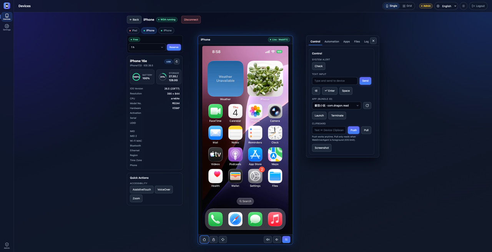
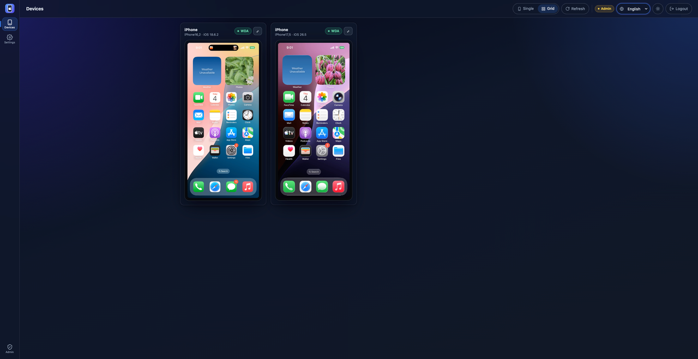

# WebAppFlaskauto-iOS — Browser-based iOS Real-Device Mirroring & Control Platform

<div align="center">


**A Web-based iOS Screen Mirroring, Control, and Operations Platform Powered by WebDriverAgent**

[](https://python.org)
[](https://flask.palletsprojects.com)
[](https://vuejs.org)
[](https://github.com/aiortc/aiortc)
[](https://github.com/doronz88/pymobiledevice3)
[](LICENSE)

[中文](README.md) • [English](README_en.md)

[Features](#features) • [Quick Start](#quick-start) • [Security](#security-design) • [API](#api-reference) • [Troubleshooting](#troubleshooting)

</div>

> This repo is the **iOS counterpart** of the Android project **WebAppFlaskscrcpy**. It deliberately mirrors that project's architecture and tech stack (Flask + Flask-SocketIO backend, `api/` + `services/` + a platform adapter, a Vue 3 frontend with `components/` + `composables/`) so the two can be merged into one platform later. **This repo implements iOS only.**

## Introduction

WebAppFlaskauto-iOS is a **pure-browser** iOS real-device mirroring and control platform. With no client to install, open a web page to: discover a connected iPhone, mirror its screen live, remotely tap/swipe/type, screenshot, manage apps, browse/preview/transfer files, watch live syslog, and run UI-automation locators.

Under the hood it drives the device via **WebDriverAgent (WDA)**; the picture uses **WDA MJPEG (primary) + screenshot polling (fallback)**, with optional **WebRTC (aiortc)** low-latency video. Device discovery and lockdown info use the pure-Python **pymobiledevice3**; the admin-free tunnel and WDA bring-up for iOS 17+ are handled by the bundled **go-ios**.

On top of mirroring, the platform ships a full **account system** and a **device reservation (occupancy)** model, so it works as a shared team iOS device-ops console: who's using which device is obvious, and admins can force-release and manage users.

## Screenshots

<div align="center">

**Single-device view**



**Multi-device view**



</div>

## Background

### Industry context

Remote control of real iOS devices is common in testing, ops, and demos, but it's harder than Android:

- **Heavy onboarding** — Appium/Xcode/tidevice chains are heavyweight; iOS 17+ also needs a tunnel (often admin).
- **Contention** — one device gets grabbed by many people at once with no exclusivity.
- **No permission boundary** — anyone can connect/control; no accounts, no audit.
- **Cross-platform fragmentation** — tunnel/usbmux/process management differ across Windows / macOS / Linux.

### Goals

1. **Zero client** — the browser is the console; reachable from any device on the LAN.
2. **Admin-free** — for iOS 17+, go-ios brings up an **userspace RSD tunnel** and launches WDA without an elevated tunneld.
3. **Governable** — accounts + roles + reservations turn real devices into schedulable, auditable shared resources.
4. **Cross-platform & lightweight** — talk to WDA directly (no Appium Server), one codebase on all three OSes.

## Pain Points Solved

### 1. High barrier to iOS remote control
**Problem:** Appium Server / Xcode / toolchains are heavy and version-sensitive.
**Solution:** Talk to **WebDriverAgent directly over HTTP** — no Appium Server process. Discovery / usbmux forwarding / WDA HTTP all go through pure-Python **pymobiledevice3**, which is Flask-friendly.

### 2. iOS 17+ tunnel needs admin
**Problem:** The iOS-17+ RSD tunnel usually needs admin on Windows.
**Solution:** The bundled **go-ios** binary owns only the one thing pymobiledevice3 can't do admin-free — an **userspace RSD tunnel + `ios runwda`** to launch WDA (default `IOS_USE_GOIOS=1`). It's complementary; if absent the code falls back to the pymobiledevice3 xcuitest launcher.

### 3. Multiple people fighting over one device
**Problem:** Real devices are scarce; concurrent connections interrupt each other.
**Solution:** A **reservation model** — claim a device for a window; only the owner can control it; self-release, auto-reclaim on expiry, admin force-release.

### 4. No permissions or audit
**Problem:** No accounts; anyone can connect, nothing is controllable or traceable.
**Solution:** A three-tier role system (super admin / admin / user), server-side sessions, a unified login gate, and an admin user-management panel.

### 5. Cross-platform differences
**Problem:** Tunnel/usbmux/port/process management differ across the three OSes.
**Solution:** The `start_dev.py` launcher branches per OS (port cleanup, process groups, venv paths); the go-ios binary is bundled per platform (extracted on first use on macOS/Linux).

## How It Works

### Core architecture

```
Browser (Vue3 SPA)
   │  HTTP /api/*      Socket.IO (devices/stream/control/logs)   WebRTC (optional: video + control DataChannel)
   ▼                         ▼                                       ▼
Flask + Flask-SocketIO (async_mode="threading")
   │  api/  →  services/  →  ios/ios_adapter.py
   ▼
IOSAdapter
 ├─ DeviceManager   pymobiledevice3: discovery / lockdown info             ┐ Flask-native
 ├─ PortForward     pymobiledevice3 usbmux: local → WDA 8100/9100          │ main path
 ├─ WDAController   WebDriverAgent HTTP: tap/swipe/text/screenshot/apps     ┘ (no tunnel)
 ├─ GoIOS + Tunnel  go-ios: userspace RSD tunnel (no admin) + `runwda`     ← iOS 17+ bring-up
 ├─ ScreenProvider  wda_mjpeg (primary) / wda_screenshot (fallback)
 └─ StreamBridge    frames → Socket.IO room=udid
                    WebRTCBridge → aiortc (JpegVideoTrack, host-side libx264)
   ▼
SQLite (accounts / sessions / reservations)
```

### Engine split (deliberate)

- **pymobiledevice3 (pure Python, main engine):** everything that doesn't need a tunnel — discovery, usbmux forwarding to WDA (8100 control / 9100 MJPEG), all WDA HTTP.
- **go-ios (optional, complement):** only what pymobiledevice3 can't do admin-free on Windows/iOS 17+ — the **userspace tunnel + launching WDA**. Complementary, not a swap: absent → fall back. (go-ios ≠ tidevice; tidevice is not used.)

### Picture pipeline (why MJPEG first)

iOS has no scrcpy-style H.264 mirror without a macOS capture path. The fastest working loop is WDA **MJPEG** (primary) + **screenshot** polling (fallback), both cross-platform. Optional **WebRTC** (`IOS_ENABLE_WEBRTC=1`): `JpegVideoTrack` decodes MJPEG bytes and re-encodes via aiortc (H264 first, VP8 fallback) with mid-stream self-heal (swap to the screenshot provider without tearing down the PC); a browser `control` DataChannel reuses the same PeerConnection for input. `IOS_WEBRTC_MAX_BITRATE` (default 6 Mbps) raises the bitrate ceiling for sharper motion — it's **host-side libx264**, so CPU scales with resolution × device count, and the multi-device grid auto-downscales tiles to compensate.

> History: QuickTime-over-USB hardware H.264 (QVH) was evaluated and **fully removed** — macOS libusb's whole-device claim broke usbmux/WDA control and there was no Windows build. Stability first.

### Reservation model

- `device_id` is the reservation table's primary key — a UNIQUE constraint resolves concurrent claims (the loser gets an IntegrityError, not a half-success).
- Unified release paths: self-cancel / admin force / expiry sweep thread.
- Control endpoints verify ownership; non-owners are read-only.

## Project Layout

```
WebAppFlaskauto-iOS/
├── app.py                      # Flask + Socket.IO entry; blueprints, login gate, SPA hosting
├── start_dev.py                # Cross-platform launcher (backend 5001 + Vite 5173)
├── api/                        # HTTP / Socket.IO routes (thin adapter layer)
│   ├── auth_api.py             #   login/register/session/user mgmt + lockout
│   ├── reservations_api.py     #   device reservations REST
│   ├── devices_api.py          #   list / connect / disconnect / WDA status
│   ├── control_api.py          #   tap/swipe/input/screenshot/launch/terminate/alert/clipboard
│   ├── stream_api.py           #   stream start/stop/quality/scaling
│   ├── files_api.py            #   file tree / pull / push / inline preview
│   ├── apps_api.py             #   list / install / uninstall apps
│   ├── automation_api.py       #   WDA selector find/tap/type, foreground app, page source
│   └── ...                     #   device info / accessibility / syslog (SSE)
├── services/                   # business logic
│   ├── app_db.py               #   SQLite, schema, seed accounts
│   ├── auth_service.py         #   password hashing, session tokens, roles
│   ├── request_validators.py   #   ★reusable: username/email/password rules (single source)
│   ├── rate_limit.py           #   ★reusable: login-failure limiter (anti brute-force)
│   ├── reservation_service.py  #   reservations: claim/release/sweep/assert_owner
│   ├── device_info.py          #   lockdown info aggregation (single in-process connection)
│   ├── ios_file_service.py     #   go-ios fsync: tree/pull/push
│   ├── ios_app_service.py      #   go-ios: list/install/uninstall apps
│   ├── stream_bridge.py        #   frames → Socket.IO
│   ├── webrtc_bridge.py        #   aiortc pipeline (JpegVideoTrack + bitrate tuning)
│   └── ...
├── ios/                        # iOS platform adapter
│   ├── ios_adapter.py          #   unified facade (discover/connect/control/stream)
│   ├── go_ios.py               #   go-ios wrapper (tunnel/runwda/fsync/apps/accessibility)
│   ├── tunnel_manager.py       #   userspace RSD tunnel lifecycle
│   ├── port_forward.py         #   usbmux port forwarding
│   └── screen_provider/        #   wda_mjpeg / wda_screenshot plugins
├── frontend/                   # Vue 3 + Vite (dist/ hosted by Flask)
│   └── src/{components,composables,locales}/   # en / zh-CN / zh-TW
├── scripts/{init_db.py,run_checks.py}
├── resources/{executable/<os>,utils,wintun/<arch>}/   # go-ios binary, extract source, wintun.dll
├── tests/                      # pytest white-box tests
└── data/                       # SQLite (app.db)
```

## Features

### Mirroring & control
- Live screen: WDA **MJPEG** (primary) / **screenshot** (fallback); optional **WebRTC** (H264/VP8, tunable bitrate)
- Single-device stage view / multi-device live grid (auto-downscales tiles in grid)
- Tap, swipe, text input, Home/Lock/Volume, directional D-pad (synthesized WDA swipes), screenshot
- **Accessibility quick toggles**: AssistiveTouch / VoiceOver / Zoom (via go-ios)

### Device ops
- **File browser**: expand/collapse tree, tap a file to download, **in-app preview** (image/audio/video/PDF/text in a modal), upload to device (target dir linked to the browsed path)
- **App management**: list installed apps, launch/terminate, install `.ipa`, uninstall
- **UI automation**: locate by accessibility id / predicate / xpath / class / name, find/tap/type, foreground app, **formatted page source (XML)**
- Live **syslog** (SSE; regex/process/level filters; manual start/stop to avoid idle long connections)
- Device-info card: lockdown values (model, OS, CPU, serial, UDID, IMEI×2, MACs, activation, region/time zone), battery/storage rings

### Accounts & reservations
- Three roles: super admin / admin / user; self-registration for users
- Reservations: claim for a window, self-release, auto-reclaim on expiry, admin force-release
- Admin panel: create / change email / reset password / change role / enable-disable / delete

### Experience
- Light / dark theme (with a device-card glow); English + Simplified/Traditional Chinese
- **In-app dialogs only** (no native `confirm()`/`alert()`): confirmations via `ConfirmDialog`, notices via `Toasts`
- A detail-view **DeviceStrip** to switch devices without going back; persisted view mode

## Tech Stack

**Backend:** Python 3.10+ · Flask 3.x + Flask-SocketIO (`async_mode="threading"`, keeps real OS sockets for aiortc) · pymobiledevice3 (pure Python) + bundled go-ios · aiortc + av + opencv/Pillow · WebDriverAgent (direct HTTP) · SQLite.

**Frontend:** Vue 3 + Vite SPA · socket.io-client · components + composables · self-managed i18n/theme.

## Quick Start

### Requirements
- Python 3.10+, Node.js 18+
- An iPhone that has completed the **device prep** below (trusted + Developer Mode + signed WDA installed)
- Windows also needs `wintun.dll` (iOS 17+ tunnel, see [Windows wintun.dll setup](#windows-wintundll-setup)) and **Apple Devices / iTunes** (provides the usbmux service)

### Install

```bash
# 1) Backend deps (virtualenv recommended)
python -m venv .venv
# Windows:    .venv\Scripts\activate
# macOS/Linux: source .venv/bin/activate
pip install -r requirements.txt

# 2) Frontend deps + build
cd frontend && npm install && npm run build && cd ..

# 3) Initialize the database (first run)
python scripts/init_db.py init
```

### Device prep (one-time)

1. **Trust** — connect over USB, unlock, tap "Trust This Computer".
2. **Developer Mode** (iOS 16+): Settings → Privacy & Security → Developer Mode → On (reboot).
3. **Sign & install WDA** — install **WebDriverAgent** via Xcode or a prebuilt signed `.ipa` (this project does not sign it for you). For detailed fetch / sign / build steps see: [Building & Compiling WebDriverAgent for iOS Automation](wdadoc/Building-WebDriverAgent-for-iOS-Automation.en.md).
4. **Configure the runner** — set `IOS_WDA_BUNDLE_ID` in `.env` to the installed runner, e.g. `com.facebook.WebDriverAgentRunner.xxx.xctrunner`.

> **Automatic WDA bring-up (default):** with `IOS_USE_GOIOS=1`, `connect` starts an admin-free userspace tunnel and `ios runwda` to launch WDA, forwarding device ports 8100/9100 — no manual `xcodebuild`/`tunneld`.
> **Manual:** set `IOS_USE_GOIOS=0` to run WDA yourself; the backend just forwards to WDA on 8100/9100.

### Run

```bash
# A: one-click launcher (backend 5001 + Vite 5173, opens browser)
python start_dev.py
#   python start_dev.py stop                 # free ports only
#   python start_dev.py start --local-only    # bind 127.0.0.1 only
#   python start_dev.py start --no-browser

# B: backend only (serves the built SPA)
python app.py        # http://127.0.0.1:5001

# C: frontend dev server only (proxies /api + /socket.io to :5001)
cd frontend && npm run dev   # http://127.0.0.1:5173
```

Open `http://localhost:5173` (dev) or `http://localhost:5001` (backend only) and log in.

### Seed accounts

| Role        | Username     | Password        | Notes                                 |
|-------------|--------------|-----------------|---------------------------------------|
| Super admin | `superadmin` | `superadmin123` | Cannot be deleted/disabled            |
| Admin       | `admin`      | `admin123`      | Manages users, force-releases devices |
| User        | —            | —               | Self-register on the login page       |

> **Password policy** (shared front/back: `services/request_validators.py` ↔ `frontend/src/composables/useValidators.js`): username **3–32 chars, starts with a letter/digit** (letters/digits/`.` `_` `-` only); password **8–128 chars with both letters and digits**.
> ⚠️ **Change the seed passwords before real use**, and pin `SECRET_KEY` (otherwise a backend restart invalidates all sessions).

## Windows wintun.dll setup

Only for **Windows + iOS 17+** (the userspace tunnel loads `wintun.dll` at runtime). go-ios looks for it next to its binary or in `C:\Windows\System32`.

1. Pick a CPU-arch folder under `resources/wintun/`: `amd64` (64-bit Intel/AMD, most PCs) / `arm64` / `x86`.
2. Ensure it's a real DLL (~400 KB), not a placeholder; if unsure grab the official `bin\<arch>\wintun.dll` from <https://www.wintun.net/>.
3. Put it where go-ios can load it (either):
   - copy next to the binary: `resources\executable\win\wintun.dll`, or
   - copy to `C:\Windows\System32\wintun.dll` (system-wide; one-time admin).

```powershell
copy resources\wintun\amd64\wintun.dll resources\executable\win\wintun.dll
```

Connecting an iOS 17+ device should now bring the tunnel up without `IOS17_TUNNEL_FAILED` / wintun load errors.

## Configuration

Via environment variables (or `.env`). Common ones:

| Variable                 | Default            | Description                                                                    |
|--------------------------|--------------------|--------------------------------------------------------------------------------|
| `SECRET_KEY`             | random             | Session cookie signing key; **pin in production**, else restart drops sessions |
| `HOST` / `PORT`          | `0.0.0.0` / `5001` | Backend bind address / port                                                    |
| `OPEN_BROWSER`           | `1`                | Auto-open the browser (`0` to disable)                                         |
| `IOS_USE_GOIOS`          | `1`                | Use go-ios for the admin-free tunnel + WDA (`0` = manual)                      |
| `IOS_WDA_BUNDLE_ID`      | —                  | The installed WDA runner bundle id                                             |
| `IOS_ENABLE_WEBRTC`      | `1`                | Enable WebRTC video (`0` = MJPEG/screenshot only)                              |
| `IOS_WEBRTC_MAX_BITRATE` | `6000000`          | WebRTC bitrate ceiling (host-side libx264; affects CPU)                        |
| `IOS_MJPEG_FRAMERATE`    | `40`               | MJPEG frame rate                                                               |
| `IOS_MJPEG_QUALITY`      | `70`               | MJPEG JPEG quality                                                             |
| `IOS_MJPEG_SCALING`      | `100`              | MJPEG scale % (temporarily lowered in grid view)                               |

More `IOS_*` options live in `.env` and the `ios/` sources.

## Security Design

| Area                   | Implementation                                                                                                     |
|------------------------|--------------------------------------------------------------------------------------------------------------------|
| **SQL injection**      | Parameterized queries throughout; dynamic parts use only fixed column names                                        |
| **Password store**     | Werkzeug hash + per-user random salt; never plaintext                                                              |
| **Sessions**           | Opaque server-side tokens; cookie carries only the token; revocable; cleared on restart                            |
| **Login gate**         | `before_request` guards `/api/`, allowing only login/register/auth-check                                           |
| **Brute force**        | `rate_limit.py` counts failures per `ip+username`, locks for a window (`detail.seconds` returned for localized UI) |
| **Input validation**   | `request_validators.py` single source + frontend `useValidators` mirror                                            |
| **Anti-enumeration**   | Failed login always returns "incorrect username or password"                                                       |
| **Error localization** | Backend returns stable `code`; frontend localizes by code                                                          |
| **Ownership**          | Control endpoints verify reservation ownership; non-owners are read-only                                           |

## Usage

1. **Log in / register** — new users self-register on the login page (subject to the policy).
2. **Pick a device** — the list shows free/occupied + WDA status; claim it.
3. **Enter control** — "Open / Control" opens the single-device stage; the top **DeviceStrip** switches devices.
4. **Mirror & control** — stream auto-starts on connect; tap/type/D-pad/volume; the footer "More" opens the right control drawer (control/automation/apps/files/logs).
5. **Release** — self-release any time; auto-reclaim on expiry; admins can force-release.
6. **Admin** — the left "Admin" nav opens user management.

## API Reference

Unified envelope: success `{"success":true,"data":{},"message":"ok"}`; failure `{"success":false,"code":"...","message":"...","detail":{}}`.

### Auth & users (`/api/auth/*`)

| Method              | Path                        | Access | Notes                              |
|---------------------|-----------------------------|--------|------------------------------------|
| POST                | `/api/auth/register`        | public | register (role forced to `user`)   |
| POST                | `/api/auth/login`           | public | login (with lockout)               |
| POST                | `/api/auth/logout`          | auth   | logout                             |
| GET                 | `/api/auth/check-auth`      | public | session state                      |
| GET                 | `/api/auth/profile`         | auth   | current user                       |
| POST                | `/api/auth/change-password` | auth   | change password (revokes sessions) |
| GET/POST/PUT/DELETE | `/api/auth/users[/<id>]`    | admin  | user CRUD + enable/disable         |

### Reservations (`/api/reservations*`)

| Method | Path                            | Notes                         |
|--------|---------------------------------|-------------------------------|
| GET    | `/api/reservations`             | list + max duration           |
| POST   | `/api/reservations`             | claim (device_id, minutes)    |
| DELETE | `/api/reservations/<device_id>` | release (self or admin force) |

### Devices / control / stream / ops (auth required; control needs ownership)

| Method   | Path                                                          | Notes                               |
|----------|---------------------------------------------------------------|-------------------------------------|
| GET      | `/api/health`, `/api/devices?rescan=1`, `/api/devices/<udid>` | health / list / detail              |
| GET      | `/api/devices/<udid>/info`                                    | lockdown device info                |
| POST     | `/api/devices/<udid>/connect` `/disconnect`                   | connect / disconnect (tunnel + WDA) |
| POST     | `/api/devices/<udid>/tap` `/swipe` `/input` `/screenshot`     | input / screenshot                  |
| POST     | `/api/devices/<udid>/launch` `/terminate`                     | launch / terminate app              |
| POST     | `/api/devices/<udid>/accessibility`                           | accessibility toggle                |
| GET/POST | `/api/devices/<udid>/stream/{start,stop,status,quality}`      | stream control                      |
| GET/POST | `/api/devices/<udid>/files/{tree,pull,push}`                  | file tree / download / upload       |
| GET/POST | `/api/devices/<udid>/apps[/install,/uninstall]`               | app management                      |
| POST     | `/api/devices/<udid>/automation/*`                            | WDA find/tap/type, page source      |
| GET      | `/api/devices/<udid>/syslog`                                  | live syslog (SSE)                   |

> File `pull` defaults to `attachment`; add `?inline=1` to stream with the right mimetype for in-browser preview.

### Socket.IO events
- **Stream/control:** `stream:start/stop/status`, `control:tap/swipe/input` (→ `stream:frame/started/stopped/error`)
- **WebRTC signaling** (non-trickle): `webrtc:offer` (→ `webrtc:answer` / `webrtc:error`), `webrtc:stop`
- **Devices/broadcast:** `devices:list/refresh` (→ `devices:changed`, `device:connected/disconnected`, `wda:status`)

## Database Tool

```bash
python scripts/init_db.py init    # create tables + seed accounts (idempotent)
python scripts/init_db.py status  # show accounts / reservations / file size
python scripts/init_db.py clear   # wipe runtime data, keep super_admin / admin
python scripts/init_db.py reset   # drop & recreate (destructive)
python scripts/init_db.py backup  # timestamped backup of data/app.db
```

## Testing

```bash
python -m pytest tests/ -q       # full white-box suite (accounts/validation/limit/reservation/adapter)
python scripts/run_checks.py     # one-click: build SPA + unit + self-booting e2e + front/back contract
```

`run_checks.py` chains build → `pytest` → isolated-backend real-device e2e (smoke/multidevice/idle/webrtc) → the contract suite, printing a PASS/FAIL/SKIP summary; a suite whose port is taken is **skipped** (with a reason) rather than crashing.

## Deployment / Cross-platform

- **Dev:** `python start_dev.py` (Werkzeug dev server, dev only).
- **Production:** the bundled server is a dev server; use a real WSGI server, pin `SECRET_KEY`, change seed passwords, and limit exposure with `--local-only` or a reverse proxy.
- **All three OSes** run MJPEG/screenshot; `start_dev.py` branches per OS for ports/process-groups/venv paths; the go-ios binary is bundled per platform (auto-extracted on macOS/Linux; Windows needs `wintun.dll`). Linux is not yet fully validated on real hardware.

## Troubleshooting

- **No devices** → unlocked? trusted? does `python -m pymobiledevice3 usbmux list` show it?
- **WDA_NOT_RUNNING** → WDA installed and running on 8100? `IOS_WDA_BUNDLE_ID` correct?
- **IOS17_TUNNEL_FAILED** → iOS 17+ tunnel didn't start: on Windows check `wintun.dll`; or set `IOS_USE_GOIOS=0` and start the tunnel/WDA manually.
- **Black screen** → try the `screenshot` provider; MJPEG needs WDA's MJPEG server (9100).
- **Re-login after restart** → `SECRET_KEY` not pinned (random key changes each boot); pin it to fix.
- **Windows usbmux finds nothing** → install Apple Devices / iTunes (provides the Apple Mobile Device Service).

---

> Architecturally aligned with the Android project **WebAppFlaskscrcpy** (matching layout/layers/accounts-reservations/frontend components) for a future unified Android + iOS platform.
