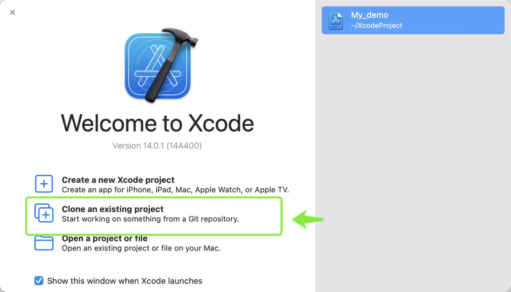
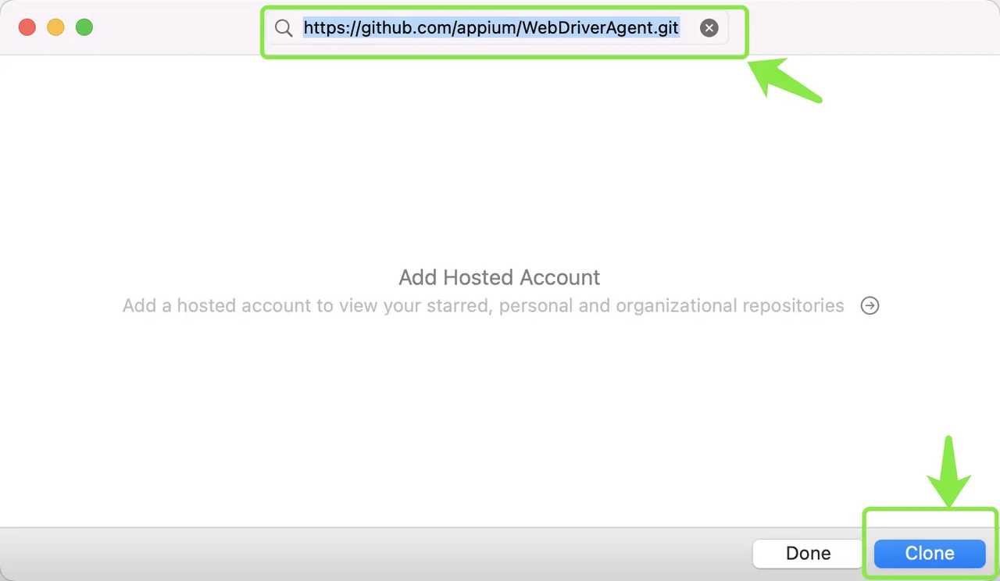
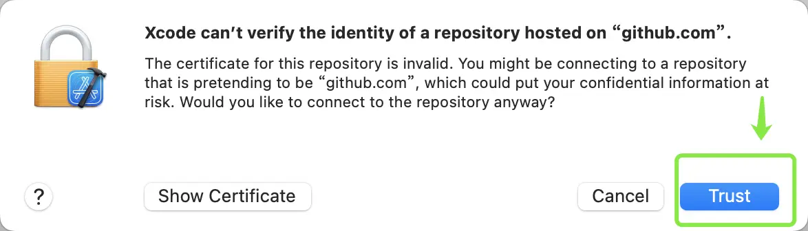
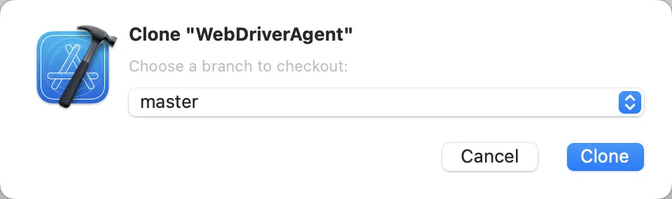
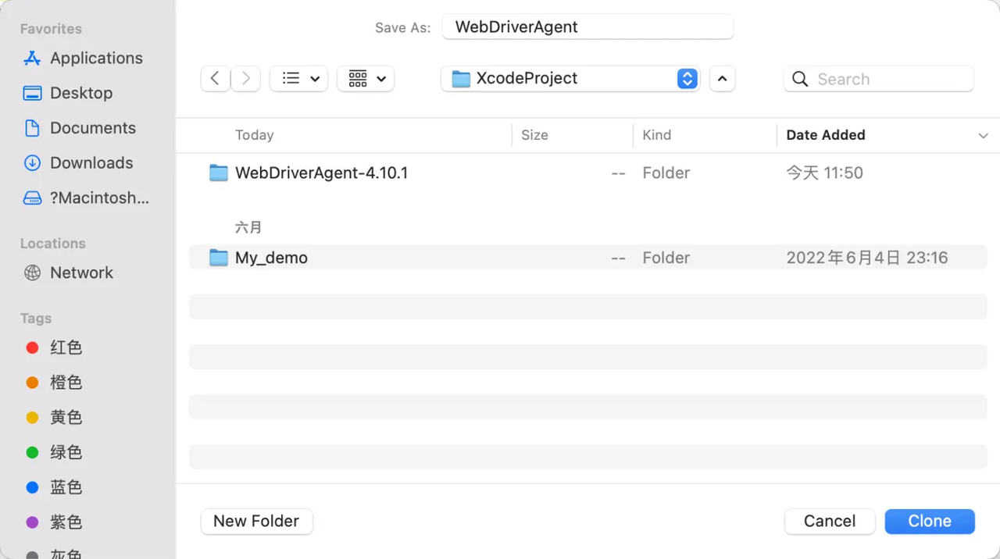
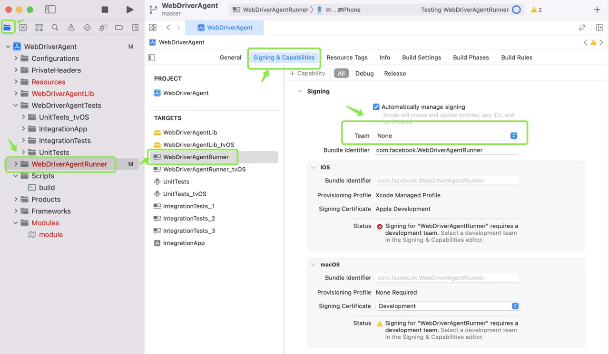
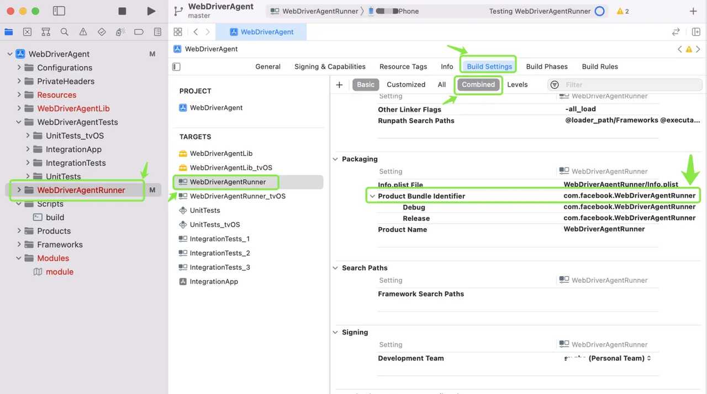
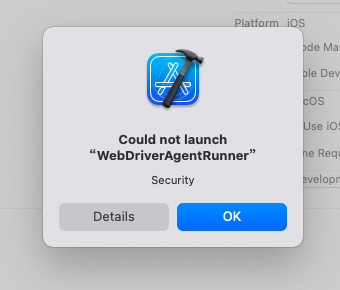
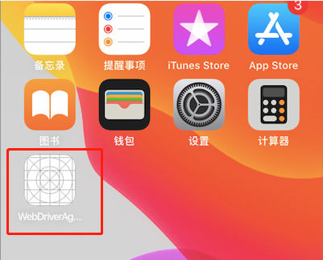
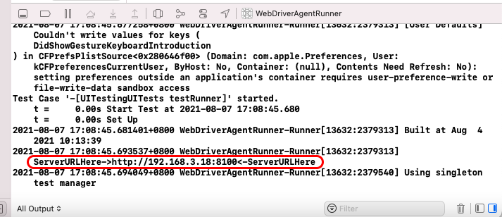

# Building & Compiling WebDriverAgent for iOS Automation

> 3.1.11　Fetching & compiling WebDriverAgent

## 1. What is WebDriverAgent?

Made by Facebook:

- Implements a server through which you can remotely control an iOS device: launch/quit apps, tap, scroll, and so on;
- Calls Apple's APIs to perform actions by linking against `XCTest.framework`;
- Supports automating multiple devices at once;
- Already integrated by Appium and Macaca.

However, WebDriverAgent only provides a server (plus an *inspect* tool for element location); it does **not** ship a Java/Python client for writing scripts the way Appium does. At runtime a client sends commands to the server, which then executes them — so you must implement the client yourself, i.e. wrap a Java/Python WebDriver library and send commands. In other words, WebDriverAgent is essentially like the Appium server: just a server. It implements a WebDriver Server on the iOS side, and through that server you can remotely drive an iOS device for testing.

## 2. About the developer certificate

Appium communicates with an iPhone precisely through WDA. Before WDA can be configured onto the phone, you must compile an Apple developer certificate into WDA via Xcode for it to take effect — **this certificate-compiling step is where errors are most likely to occur**.

Apple developer certificates come in free and paid tiers; for automation testing the free tier is enough. The catch is that a free certificate compiled into WDA via Xcode is only valid for **7 days**, after which you must rebuild. If you can obtain a full (paid) developer certificate, it can be used long-term.

## 3. Getting WebDriverAgent

Option A: use the WebDriverAgent bundled with Appium — compile the certificate in Xcode, then use it.

Option B: fetch the WebDriverAgent source locally —

```bash
git clone https://github.com/appium/WebDriverAgent.git
```

Or use Xcode's built-in Clone to pull the source locally:



*On the Xcode welcome screen, choose "Clone an existing project".*



*Paste the repository URL `https://github.com/appium/WebDriverAgent.git`, then click "Clone" (bottom-right).*



*If Xcode says it can't verify the identity of GitHub.com, click "Trust".*



*Choose the branch to check out (`master`) and click "Clone".*



*Pick a local save location and click "Clone" to finish.*

## 4. Select your developer account (Team)

After opening the project, select the free developer account you registered — pick it under **Team**:



## 5. Change the BundleID

Change WebDriverAgent's **Bundle Identifier**, appending your own unique suffix so it doesn't collide with others — e.g. `com.facebook.WebDriverAgentRunner.webeyer`:



## 6. Select the debug device and run

1. Select the debug device: **Product → Destination → your iPhone**;
2. Select the scheme: **Product → Scheme → WebDriverAgentRunner**;
3. Run the test: **Product → Test** — the app is then installed on the phone;
4. On the phone go to **Settings → General → VPN & Device Management → Developer App**, tap **Trust**, then run **Product → Test** again.

## 7. Replace the WebDriverAgent under Appium

Delete Appium's original WebDriverAgent folder and drop in the one you just built:

```text
# Installed via npm — the path is:
cd /usr/local/lib/node_modules/appium/node_modules/appium-xcuitest-driver/WebDriverAgent/

# Installed via Appium Desktop — the path is:
/Applications/Appium.app/Contents/Resources/app/node_modules/appium/node_modules/appium-xcuitest-driver/WebDriverAgent/
```

## 8. Trust the provisioning profile and rebuild

The first build fails (as shown below) because the WebDriverAgent built onto the phone needs its provisioning profile trusted. On the phone: **Settings → General → VPN & Device Management → select the profile and Trust it**.



After trusting the profile, run **Product → Test** in Xcode once more and it will succeed. A **"WebDriverAgentRunner-Runner"** app will appear on the phone — at this point you can run automation against the real iOS device.



## 9. Verify the setup — port forwarding

After WebDriverAgent is successfully built onto the phone, the Xcode console prints the device's IP and port:



In a terminal, run port forwarding:

```bash
iproxy 8300 8100
```

This command maps a port on the phone to a port on the computer: `8100` is the phone-side port and `8300` is the port mapped onto the Mac. If forwarding fails, install the dependency first:

```bash
brew install usbmuxd
```

Once forwarding succeeds, open `local address + forwarded port` in Safari (or any browser): [http://localhost:8300/status](http://localhost:8300/status). Output similar to the following means the WebDriverAgent server is healthy:

```json
{
  "value": {
    "message": "WebDriverAgent is ready to accept commands",
    "state": "success",
    "os": {
      "testmanagerdVersion": 28,
      "name": "iOS",
      "sdkVersion": "14.5",
      "version": "13.3"
    },
    "ios": {
      "ip": "192.168.3.18"
    },
    "ready": true,
    "build": {
      "time": "Aug  4 2021 10:13:40",
      "productBundleIdentifier": "com.facebook.WebDriverAgentRunner"
    }
  },
  "sessionId": null
}
```
